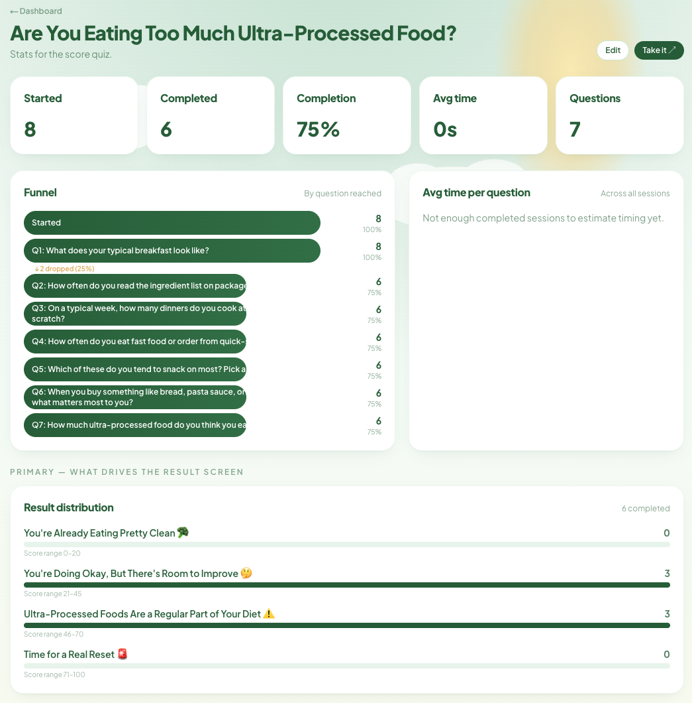
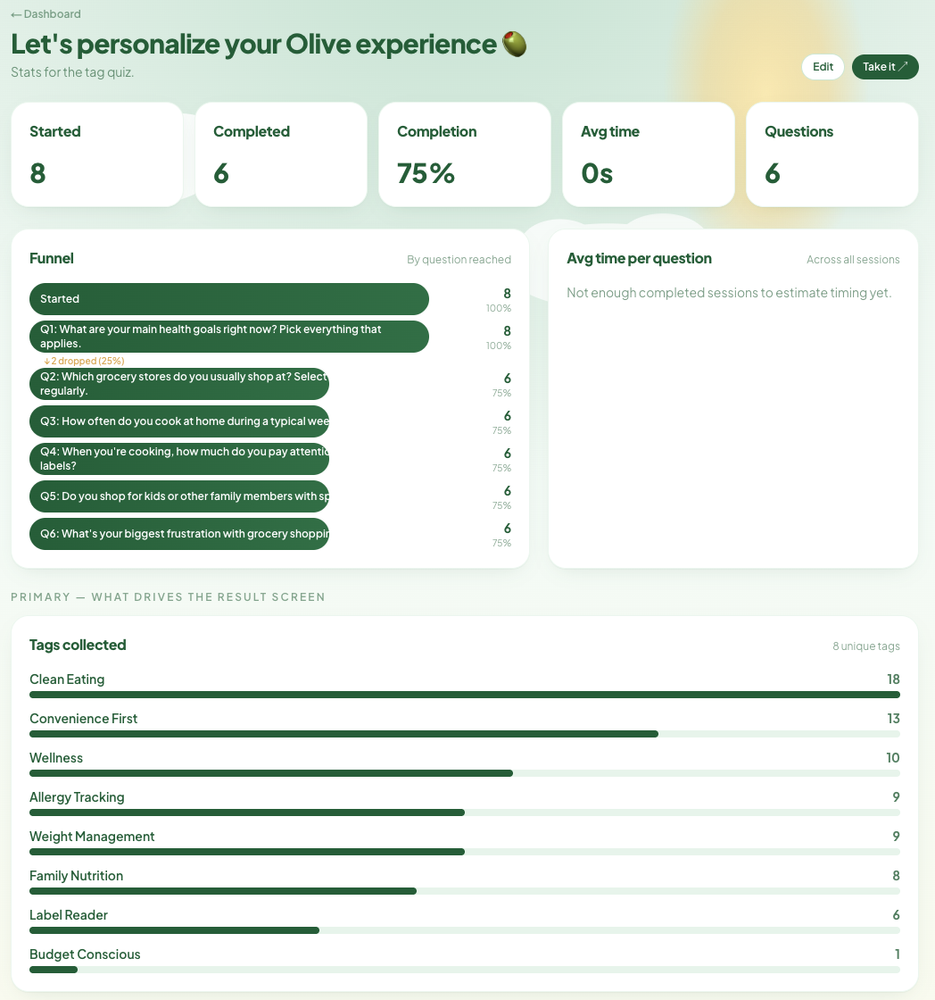
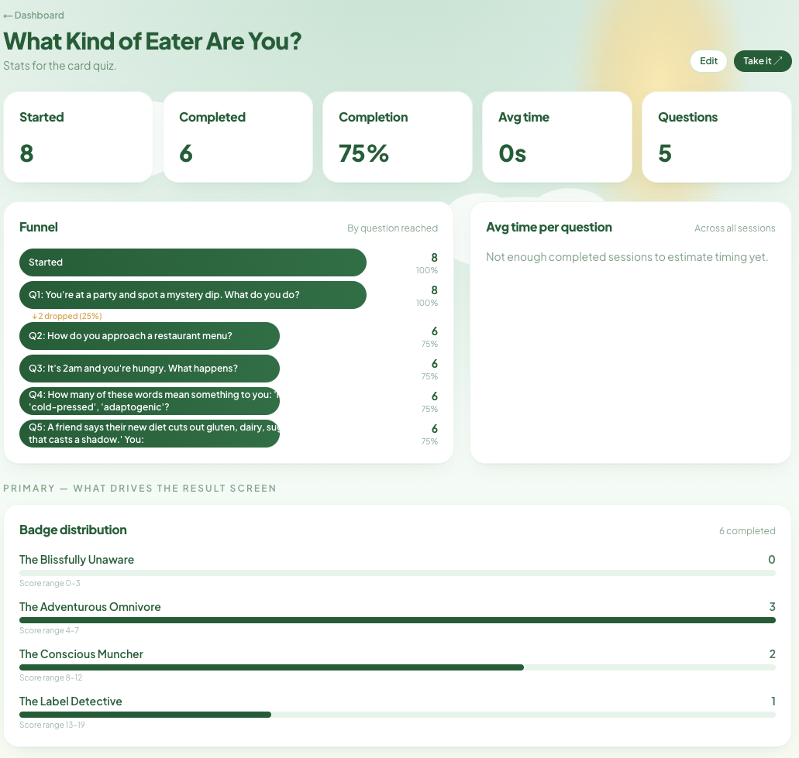

# Example generated quizzes

Three quizzes generated end-to-end through `POST /api/ai/create` from the original brief's example prompts. Each section shows the verbatim prompt sent to Sonnet 4.6, a screenshot of the live taker, and the full quiz JSON the AI produced (post `normalizeIdsForCreate` UUID rewrite).

---

## 1. Score quiz — Ultra-processed food

**Prompt**

> Build me a quiz that helps someone figure out if they're eating too much ultra-processed food. Ask about their breakfast habits, how often they read ingredient labels, whether they cook at home, and how often they eat fast food. At the end, give them a score and recommend whether they should try Olive.

**Live result screen**



**Generated quiz spec**

```json
{
  "id": "1b52f940-a5b7-471c-8a4d-78d12f27cf56",
  "type": "score",
  "title": "Are You Eating Too Much Ultra-Processed Food?",
  "description": "Answer a few quick questions about your daily eating habits and we'll tell you where you stand — no judgment, just honest insights.",
  "questions": [
    {
      "id": "04c18f7f-cb8a-42d1-8ef6-f27e68449b7e",
      "text": "What does your typical breakfast look like?",
      "type": "multiple_choice",
      "position": 0,
      "options": [
        { "id": "19b1dda2-368d-4ce9-8dea-8dcba7e5f549", "text": "A bowl of sugary cereal or a packaged pastry", "position": 0, "score": 10, "tags": ["ultra-processed", "convenience-first"] },
        { "id": "8bdfca69-e975-4e9a-8785-e80c02896650", "text": "A store-bought protein bar or flavored yogurt", "position": 1, "score": 7, "tags": ["semi-processed", "convenience-first"] },
        { "id": "99f6661f-4934-4238-a7d3-fb8d694edc7f", "text": "Eggs, toast, or oatmeal I make myself", "position": 2, "score": 3, "tags": ["whole-food", "home-cook"] },
        { "id": "7cabc3f7-4485-4046-b3ad-853a0240fb37", "text": "Fresh fruit, nuts, or something minimally processed", "position": 3, "score": 1, "tags": ["whole-food", "label-reader"] }
      ]
    },
    {
      "id": "5d66dc6c-08e2-4a6c-88ea-ee309547c72d",
      "text": "How often do you read the ingredient list on packaged foods?",
      "type": "multiple_choice",
      "position": 1,
      "options": [
        { "id": "f9a1b02a-f061-4272-a575-708bbb22f285", "text": "Almost never — I just grab what looks good", "position": 0, "score": 10, "tags": ["ultra-processed", "convenience-first"] },
        { "id": "15b22041-b400-4577-932c-ed8979dc4fc4", "text": "Sometimes, if I'm curious or something seems off", "position": 1, "score": 6, "tags": ["semi-processed"] },
        { "id": "d3623341-3cde-4862-bc58-f4d504206cbf", "text": "Often — I try to avoid additives and long lists", "position": 2, "score": 3, "tags": ["label-reader"] },
        { "id": "18d4c155-77e0-46ce-84a3-4fe895fa5441", "text": "Always — I won't buy something without checking", "position": 3, "score": 1, "tags": ["label-reader", "whole-food"] }
      ]
    },
    {
      "id": "060a3b3f-2d2d-495c-b3fa-962f26c27dc4",
      "text": "On a typical week, how many dinners do you cook at home from scratch?",
      "type": "multiple_choice",
      "position": 2,
      "options": [
        { "id": "9ec5a9e5-32a7-4b99-b229-e90ad1d12b43", "text": "Zero — cooking just isn't in my routine", "position": 0, "score": 10, "tags": ["convenience-first", "ultra-processed"] },
        { "id": "b58563aa-decb-4949-b6cc-ac6394c07306", "text": "One or two nights at most", "position": 1, "score": 7, "tags": ["convenience-first"] },
        { "id": "82fbcee6-a02f-43d1-9ddb-ef6312e6a42d", "text": "Three to four nights", "position": 2, "score": 4, "tags": ["home-cook"] },
        { "id": "b89c4675-e860-452c-af77-c7280f87a201", "text": "Five or more nights — I love cooking", "position": 3, "score": 1, "tags": ["home-cook", "whole-food"] }
      ]
    },
    {
      "id": "5182a698-76e7-4509-a331-51cd4ac1e336",
      "text": "How often do you eat fast food or order from quick-service chains?",
      "type": "multiple_choice",
      "position": 3,
      "options": [
        { "id": "ea7993ea-4b16-460f-b6c9-c761ff8d9e14", "text": "Almost every day", "position": 0, "score": 10, "tags": ["ultra-processed", "convenience-first"] },
        { "id": "778f5057-7a63-4421-92c6-d1767ae81605", "text": "A few times a week", "position": 1, "score": 7, "tags": ["ultra-processed", "convenience-first"] },
        { "id": "3a0bfa03-1887-48ca-af26-50f299256b4a", "text": "Once a week or so", "position": 2, "score": 4, "tags": ["semi-processed"] },
        { "id": "48a22934-5fd0-40e7-b5e0-879aa135aafe", "text": "Rarely or never", "position": 3, "score": 1, "tags": ["whole-food", "label-reader"] }
      ]
    },
    {
      "id": "a0427782-69c9-421e-993a-41690aa47ae3",
      "text": "Which of these do you tend to snack on most? Pick all that apply.",
      "type": "select_multiple",
      "position": 4,
      "options": [
        { "id": "bba28da0-1fb2-4873-88c3-605022e44712", "text": "Chips, crackers, or packaged cookies", "position": 0, "score": 5, "tags": ["ultra-processed", "convenience-first"] },
        { "id": "13bcdfdb-45fa-4f8e-bb8e-e3714780690d", "text": "Candy bars or flavored snack cakes", "position": 1, "score": 5, "tags": ["ultra-processed"] },
        { "id": "2a7ccf9a-8cb5-4470-be84-532dedb9a941", "text": "Fruit, veggies, or cheese", "position": 2, "score": 1, "tags": ["whole-food"] },
        { "id": "c839957c-1456-4e5c-bc47-2138522d9b43", "text": "Nuts, seeds, or plain yogurt", "position": 3, "score": 1, "tags": ["whole-food", "label-reader"] }
      ]
    },
    {
      "id": "e26c69ce-7767-4fc3-b008-4be755ead652",
      "text": "When you buy something like bread, pasta sauce, or salad dressing, what matters most to you?",
      "type": "multiple_choice",
      "position": 5,
      "options": [
        { "id": "8bdef50c-69fb-4f4d-902c-3c3ea99f9ce0", "text": "Price and convenience — I grab whatever's easiest", "position": 0, "score": 8, "tags": ["convenience-first", "ultra-processed"] },
        { "id": "71599c0b-9ac9-42f4-80f6-0f4456f63a28", "text": "Brand recognition — I stick with what I know", "position": 1, "score": 6, "tags": ["convenience-first", "semi-processed"] },
        { "id": "64127d6c-cd3b-4bbf-a900-ffa952b89bf5", "text": "A short, recognizable ingredient list", "position": 2, "score": 3, "tags": ["label-reader", "whole-food"] },
        { "id": "59af6a58-7935-4ee0-98f9-72bc53492cf7", "text": "I'd rather just make it myself", "position": 3, "score": 1, "tags": ["home-cook", "whole-food"] }
      ]
    },
    {
      "id": "0f01c13d-bbb5-4472-9957-cba9e2771aae",
      "text": "How much ultra-processed food do you think you eat?",
      "type": "slider",
      "position": 6,
      "options": [
        { "id": "f73fb64b-3488-4e18-aaa2-33fa9773a21b", "text": "My honest guess: ultra-processed share of my diet", "position": 0, "score": 10, "tags": ["self-awareness"] }
      ]
    }
  ],
  "results": [
    { "id": "09fe6763-e59d-4f33-94ba-a9e65f2fc53a", "title_text": "You're Already Eating Pretty Clean 🥦", "description": "Your habits show real awareness — you cook at home, read labels, and keep processed foods to a minimum. Olive can help you keep that momentum and discover even better options.", "cta_text": "See How Olive Can Help", "cta_url": "https://oliveapp.com/", "range": [0, 20] },
    { "id": "509e39e0-713e-4997-9d24-c65acefa3cc1", "title_text": "You're Doing Okay, But There's Room to Improve 🤔", "description": "You're making some good choices, but ultra-processed foods are sneaking in more than you might realize. Olive can help you spot them and swap them out without overhauling your whole routine.", "cta_text": "Try Olive Free", "cta_url": "https://oliveapp.com/", "range": [21, 45] },
    { "id": "247720b5-b4e1-4cff-87e9-684b368cf9e7", "title_text": "Ultra-Processed Foods Are a Regular Part of Your Diet ⚠️", "description": "Your diet leans heavily on convenience and packaged foods — which is super common, but worth addressing. Olive was built for exactly this: making it easier to eat better without the overwhelm.", "cta_text": "Give Olive a Try", "cta_url": "https://oliveapp.com/#features", "range": [46, 70] },
    { "id": "7db0117c-29ea-4185-b015-3df9241f8323", "title_text": "Time for a Real Reset 🚨", "description": "Your eating habits are heavily driven by ultra-processed foods, and it's likely affecting how you feel. Olive can be your guide to understanding what's actually in your food and making changes that stick.", "cta_text": "Start Your Reset with Olive", "cta_url": "https://oliveapp.com/#features", "range": [71, 100] }
  ]
}
```

---

## 2. Tag quiz — Olive onboarding

**Prompt**

> Onboarding quiz for new Olive users. Ask what their health goals are (weight loss, cleaner eating, allergy tracking, feeding kids better), what grocery stores they shop at, and how often they cook. Use their answers to personalize their first experience.

**Live result screen**



**Generated quiz spec**

```json
{
  "id": "82b573e6-0bd6-4407-b65a-2206a3572173",
  "type": "tag",
  "title": "Let's personalize your Olive experience 🫒",
  "description": "Answer a few quick questions so we can tailor your grocery lists, meal ideas, and ingredient swaps to fit your life. No wrong answers — just your honest habits!",
  "questions": [
    {
      "id": "40faccdb-5218-40da-a364-b69fc676f525",
      "text": "What are your main health goals right now? Pick everything that applies.",
      "type": "select_multiple",
      "position": 0,
      "options": [
        { "id": "ce766566-71b3-4773-b42e-10edaa483f8d", "text": "Lose weight or manage my body composition", "position": 0, "score": 3, "tags": ["weight-management"] },
        { "id": "18f25a6b-817e-476c-9c63-eeadc74c6aa3", "text": "Eat cleaner and cut out processed stuff", "position": 1, "score": 3, "tags": ["clean-eating"] },
        { "id": "438e5bcc-5812-4c57-bf66-67895432a269", "text": "Track allergens or avoid specific ingredients", "position": 2, "score": 3, "tags": ["allergy-tracking"] },
        { "id": "f0acb4fb-9898-431b-a193-362db8db14be", "text": "Feed my kids healthier meals", "position": 3, "score": 3, "tags": ["family-nutrition"] },
        { "id": "e6ffa23b-1fa5-48be-908d-639f10eaa656", "text": "Build more balanced, nutritious meals overall", "position": 4, "score": 2, "tags": ["clean-eating", "wellness"] },
        { "id": "096dc59f-6669-439b-a301-19a4c11d193c", "text": "Just make grocery shopping less stressful", "position": 5, "score": 1, "tags": ["convenience-first"] }
      ]
    },
    {
      "id": "f075f209-18f5-4dbc-b244-c8e40d85becb",
      "text": "Which grocery stores do you usually shop at? Select all that you visit regularly.",
      "type": "select_multiple",
      "position": 1,
      "options": [
        { "id": "a6d58df0-68ab-46a4-a8da-050c38565ece", "text": "Whole Foods or other natural/organic stores", "position": 0, "score": 3, "tags": ["clean-eating", "wellness"] },
        { "id": "6463e8d4-7525-4a00-9418-9fd7c1e58bb6", "text": "Trader Joe's", "position": 1, "score": 2, "tags": ["clean-eating", "convenience-first"] },
        { "id": "3a1f4661-f5e4-4ee6-b509-6cbcdf99e100", "text": "Kroger, Safeway, or similar chain supermarkets", "position": 2, "score": 1, "tags": ["convenience-first"] },
        { "id": "ea85820a-08af-446e-b04b-1719f7b98452", "text": "Costco or Sam's Club", "position": 3, "score": 1, "tags": ["family-nutrition", "convenience-first"] },
        { "id": "aa4c4501-d72b-487e-bc03-26c4ce1d1779", "text": "Walmart or Target", "position": 4, "score": 1, "tags": ["convenience-first", "budget-conscious"] },
        { "id": "4fdcec2d-e920-4ee2-836e-81a9f28f5eca", "text": "Local farmers markets or co-ops", "position": 5, "score": 3, "tags": ["clean-eating", "wellness", "label-reader"] }
      ]
    },
    {
      "id": "10c531ea-f8f1-4a6b-b1b6-f094f2e4d402",
      "text": "How often do you cook at home during a typical week?",
      "type": "slider",
      "position": 2,
      "options": [
        { "id": "a366b3f5-8ac2-410e-ab26-3913c05a31f5", "text": "Nights per week I cook at home", "position": 0, "score": 7, "tags": ["home-cooking"] }
      ]
    },
    {
      "id": "c403626f-eba8-4f53-9ab6-6944913f2d18",
      "text": "When you're cooking, how much do you pay attention to ingredient labels?",
      "type": "multiple_choice",
      "position": 3,
      "options": [
        { "id": "156834c7-9942-43c4-b87f-605ea88b3044", "text": "I read every label — ingredients, additives, the works", "position": 0, "score": 4, "tags": ["label-reader", "clean-eating"] },
        { "id": "52414fe8-089e-4bac-813c-f5ed34a79602", "text": "I check for a few things I know I want to avoid", "position": 1, "score": 3, "tags": ["label-reader", "allergy-tracking"] },
        { "id": "a345d788-4934-4820-a740-ab4a8388bb40", "text": "I glance at the nutrition facts but don't go deep", "position": 2, "score": 2, "tags": ["wellness"] },
        { "id": "edee5baf-684d-4ba6-8c80-e68d3404712c", "text": "Honestly, I just grab what looks good and move on", "position": 3, "score": 1, "tags": ["convenience-first"] }
      ]
    },
    {
      "id": "04e20092-33ed-4ed5-a367-7f3e41af5848",
      "text": "Do you shop for kids or other family members with specific needs?",
      "type": "multiple_choice",
      "position": 4,
      "options": [
        { "id": "d56ce40a-e1f3-4dfe-b37a-8fd0992ce72c", "text": "Yes — I'm buying for picky kids", "position": 0, "score": 3, "tags": ["family-nutrition"] },
        { "id": "512e97a1-c3a0-4c53-b618-19747bb5c366", "text": "Yes — someone in my household has allergies or dietary restrictions", "position": 1, "score": 4, "tags": ["allergy-tracking", "family-nutrition"] },
        { "id": "4326fcbd-386e-402c-bb89-06802e3470f0", "text": "Yes — I cook for adults with different preferences", "position": 2, "score": 2, "tags": ["family-nutrition", "convenience-first"] },
        { "id": "f829c10a-acf3-435a-8dff-1c78f76c406e", "text": "Nope, it's mostly just me (or me and a partner)", "position": 3, "score": 1, "tags": ["wellness"] }
      ]
    },
    {
      "id": "9fee502c-b574-4c2c-80db-c37d5e929a38",
      "text": "What's your biggest frustration with grocery shopping right now?",
      "type": "multiple_choice",
      "position": 5,
      "options": [
        { "id": "8b428ed0-b8a9-428a-9b75-221d4bcd4b13", "text": "I never know what's actually healthy vs. just marketed as healthy", "position": 0, "score": 4, "tags": ["label-reader", "clean-eating"] },
        { "id": "cbf1a843-08d2-4133-b278-64657dc949c1", "text": "Avoiding certain ingredients takes forever", "position": 1, "score": 4, "tags": ["allergy-tracking", "label-reader"] },
        { "id": "5d70c84b-2975-4e56-87cf-dfde01a76467", "text": "I buy stuff and it goes to waste before I use it", "position": 2, "score": 2, "tags": ["convenience-first", "wellness"] },
        { "id": "e1a09659-1b55-4cb4-a452-4e220a28f987", "text": "Finding things the whole family will actually eat", "position": 3, "score": 3, "tags": ["family-nutrition"] },
        { "id": "06ce4172-cb14-4e81-b46f-9739ab804663", "text": "Sticking to a budget without sacrificing quality", "position": 4, "score": 2, "tags": ["budget-conscious", "weight-management"] }
      ]
    }
  ],
  "results": []
}
```

---

## 3. Card quiz — What kind of eater are you?

**Prompt**

> Fun 5-question quiz: 'What kind of eater are you?' with silly personality-style answers. At the end, assign them a type like 'The Label Detective' or 'The Blissfully Unaware' with a shareable result card.

**Live result screen**



**Generated quiz spec**

```json
{
  "id": "46a5596c-6c05-435b-a181-872892ec074f",
  "type": "card",
  "title": "What Kind of Eater Are You?",
  "description": "Five quick questions. Zero judgment. Possibly one existential crisis about your snack drawer.",
  "questions": [
    {
      "id": "55206eed-3c54-4cdc-ac4b-0bd9ae5b13ab",
      "text": "It's 3pm and your stomach growls. What's your first move?",
      "type": "multiple_choice",
      "position": 0,
      "options": [
        { "id": "1765ad00-7ed0-498a-87eb-f6c9125c3946", "text": "Check the nutrition label on whatever's nearest — gotta know the macros", "position": 0, "score": 4, "tags": ["label-reader", "planner"] },
        { "id": "f4a1f720-9d49-4159-9732-3b80d791fb4f", "text": "Grab a handful of something from the snack drawer without looking", "position": 1, "score": 1, "tags": ["instinct-eater", "carefree"] },
        { "id": "722d01ea-160e-45f3-a06c-c8d1b29cae96", "text": "Open the fridge, stare for 3 minutes, close it, repeat", "position": 2, "score": 2, "tags": ["indecisive", "carefree"] },
        { "id": "cc6e79e1-8630-4b22-80f4-7e8d7dde3c72", "text": "Pull up a recipe app and decide to make something from scratch", "position": 3, "score": 3, "tags": ["food-adventurer", "planner"] }
      ]
    },
    {
      "id": "b185221a-05d1-47b1-b7cb-97cd780a8b30",
      "text": "You're at a restaurant and the menu has something you've never heard of. You…",
      "type": "multiple_choice",
      "position": 1,
      "options": [
        { "id": "78d94545-6942-42bd-ba65-f65bdb52de6f", "text": "Order it immediately — mystery dish, let's GO", "position": 0, "score": 3, "tags": ["food-adventurer", "instinct-eater"] },
        { "id": "ebca0092-35e0-4815-941a-166f157e4b08", "text": "Google it under the table before committing", "position": 1, "score": 4, "tags": ["label-reader", "planner"] },
        { "id": "720e2a2e-cea0-4ccc-812d-e7e7fe3ac5b6", "text": "Ask the waiter exactly what's in it, where it's from, and how it's cooked", "position": 2, "score": 5, "tags": ["label-reader", "planner"] },
        { "id": "c6072190-4049-49cd-9121-21ec25f5cd79", "text": "Order your usual. Why gamble on dinner?", "position": 3, "score": 1, "tags": ["creature-of-habit", "carefree"] }
      ]
    },
    {
      "id": "2a06080b-d13e-475f-9f34-624a04cf96ca",
      "text": "How many ingredients are in your fridge right now that you genuinely cannot identify?",
      "type": "slider",
      "position": 2,
      "options": [
        { "id": "712f9656-b890-4dc7-8ebd-22ddd62748b6", "text": "Mystery fridge items (0 = none, 10 = full chaos)", "position": 0, "score": 10, "tags": ["carefree", "instinct-eater"] }
      ]
    },
    {
      "id": "ee3c2a29-e02b-477c-b8bf-ed77153159e4",
      "text": "Pick every eating habit that sounds like you:",
      "type": "select_multiple",
      "position": 3,
      "options": [
        { "id": "2a110421-2bc3-477e-9f81-c2a8ef7aa23e", "text": "I read ingredient lists before buying anything", "position": 0, "score": 4, "tags": ["label-reader"] },
        { "id": "8b9c4352-62c6-47b3-ac5f-7a9fcb41a723", "text": "I've eaten cereal for dinner unironically this month", "position": 1, "score": 1, "tags": ["carefree", "instinct-eater"] },
        { "id": "56494d05-42d1-40ea-9679-c9fc77c85eb8", "text": "I have a \"things I want to try cooking\" list", "position": 2, "score": 3, "tags": ["food-adventurer", "planner"] },
        { "id": "7cf31a0e-ada6-487f-a5a0-a0dd8b19cc43", "text": "I could name my top 5 go-to meals without thinking", "position": 3, "score": 2, "tags": ["creature-of-habit"] },
        { "id": "bab8df64-cbc7-4bf8-b102-7b5e1b890bf5", "text": "I've impulse-bought a snack based purely on packaging", "position": 4, "score": 1, "tags": ["instinct-eater", "carefree"] }
      ]
    },
    {
      "id": "86797527-7c2a-4051-9d15-035ae3b57aad",
      "text": "Be honest — when did you last try a food you'd never eaten before?",
      "type": "multiple_choice",
      "position": 4,
      "options": [
        { "id": "79de142d-1d1d-4308-9f19-666d7df228e5", "text": "This week! I live for new flavors", "position": 0, "score": 4, "tags": ["food-adventurer", "instinct-eater"] },
        { "id": "93b943a6-9f7b-4c57-bcc7-c38a77181a12", "text": "Last month or so — I get around eventually", "position": 1, "score": 3, "tags": ["food-adventurer", "planner"] },
        { "id": "66ecca82-0cc1-4e1d-8e85-3d23b505fcb1", "text": "I think it was… 2022? Something with mushrooms?", "position": 2, "score": 2, "tags": ["creature-of-habit", "carefree"] },
        { "id": "c7046ade-9d30-40b7-a4f7-1beeff741a28", "text": "New food is a threat and I reject the premise of this question", "position": 3, "score": 0, "tags": ["creature-of-habit", "carefree"] }
      ]
    }
  ],
  "results": [
    { "id": "a6e75a98-5354-4318-8dc7-a19207308a2f", "title_text": "The Blissfully Unaware", "description": "Your fridge is a mystery, your snack choices are vibes-based, and you once ate something that you're pretty sure expired but it tasted fine so. You're free in a way most of us will never understand. Godspeed.", "cta_text": "Meet Olive — your new food BFF", "cta_url": "https://oliveapp.com/", "range": [0, 7] },
    { "id": "7afa022a-f384-41c6-8e48-a047d5d593eb", "title_text": "The Creature of Comfort", "description": "Your top 10 meals have been your top 10 meals for years, and that's not a bug — it's a feature. You know what you like, you're efficient about getting it, and you're never disappointed. Bold strategy. It's mostly working.", "cta_text": "Discover something new with Olive", "cta_url": "https://oliveapp.com/#features", "range": [8, 17] },
    { "id": "88c6aaf9-09ff-474c-accb-bfc526e07f88", "title_text": "The Curious Omnivore", "description": "You like knowing what you're eating, but you're not about to ruin a meal by overthinking it. You'll try almost anything once and you've got a growing list of \"wait, what was that dish called?\" moments. Basically the ideal dinner party guest.", "cta_text": "Explore Olive", "cta_url": "https://oliveapp.com/", "range": [18, 27] },
    { "id": "cc3cf747-b498-4ab8-a353-1b21688036f6", "title_text": "The Label Detective", "description": "You read ingredient lists like they're crime novels. You know the difference between maltodextrin and dextrose, and frankly, you're a little suspicious of anything that doesn't have a clearly sourced supply chain. We respect you. (And slightly fear you.)", "cta_text": "See how Olive thinks about food", "cta_url": "https://oliveapp.com/#features", "range": [28, 50] }
  ]
}
```
